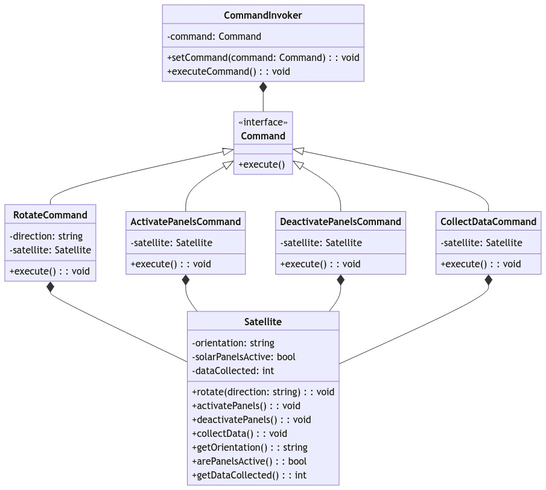
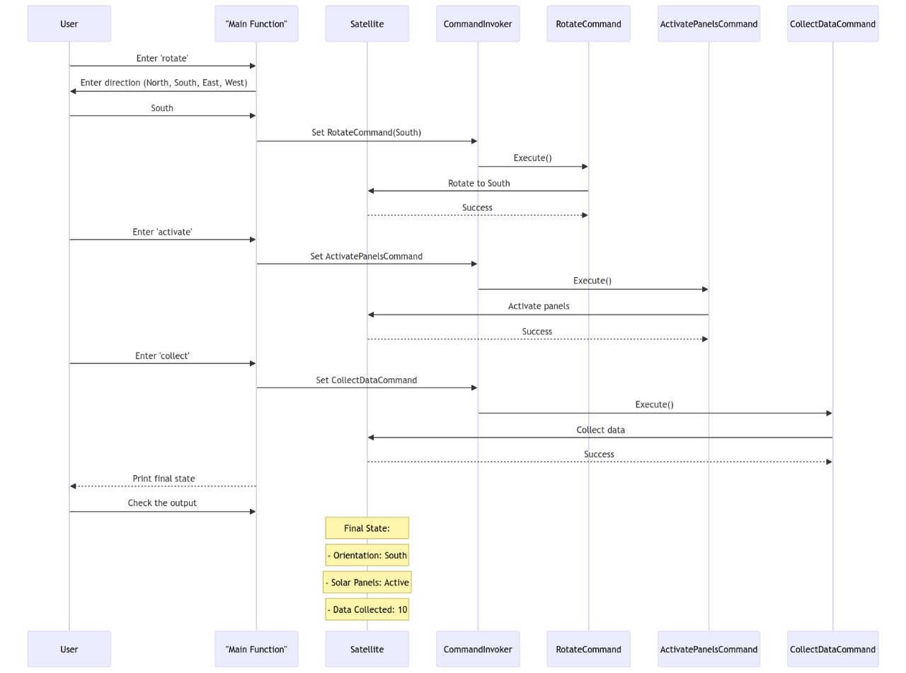

# Satellite Command System 

This project implements a satellite command system that simulates controlling a satellite in orbit.

## Features

- Initialize a `Satellite` class with default state  
- Execute commands to:
  - Rotate satellite orientation
  - Activate/deactivate solar panels
  - Collect data (only if solar panels active)
- Command pattern used to encapsulate command execution
- Logging of events and errors
- Exception handling for errors

## Input

The user can enter commands through the console:

```
Enter command (rotate, activate, deactivate, collect, exit):
```

For `rotate`, the user must also specify a direction:

```
Enter direction (North, South, East, West):
```

## Output 

The final state of the satellite is printed:

```
Orientation: North 
Solar Panels: Active
Data Collected: 10
```

## Commands

- `rotate(direction)`: Rotates satellite orientation
- `activatePanels()`: Activates solar panels  
- `deactivatePanels()`: Deactivates solar panels
- `collectData()`: Increments collected data if panels active

## Classes

- `Satellite`: Maintains state of satellite
- `Command`: Abstract base for commands 
- `RotateCommand`: Concrete command to rotate satellite
- `ActivatePanelsCommand`: Concrete command to activate panels
- `DeactivatePanelsCommand`: Concrete command to deactivate panels
- `CollectDataCommand`: Concrete command to collect data
- `CommandInvoker`: Executes commands on satellite
## Class Diagram


## Design Patterns

- **Command Pattern**: Encapsulates command execution in separate classes
- **SOLID Principles**:
  - Single responsibility principle: Each class has a single purpose
  - Open/closed principle: Easy to add new commands without modifying existing code
  - L - Liskov substitution principle: Subclasses can substitute base class
  - I - Interface segregation principle
  - D - Dependency inversion principle: Depend on abstractions, not concretions
  
## Logging 

- Main events and satellite state changes are logged to `satellite.log`
- Errors are logged to `command_error.log`

## Error Handling

- Exceptions are caught and logged when commands fail 
- Additional catch blocks handle transient errors

This implements a robust satellite command system using best practices like design patterns, SOLID principles, logging, and error handling. The system is maintainable, extensible, and simulates real-world scenarios.

## Sequence Diagram

